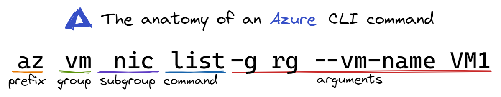
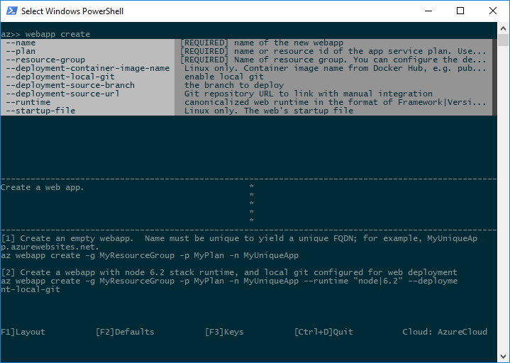

# azure-cli-basics

## What's the advantage of using an Azure command-line tool?

Azure runs on automation. Every action inside the portal translates to code being executed to read, create, modify, or delete resources. Azure command-line tools automate routine operations, standardize database failovers, and pull data that provide powerful insight. 

## Chose the right Azure Command Line Tool

 You have two options when it comes to Azure command-lines: Azure CLI and Azure Powershell. Both are cross-platform, installable on Windows, macOS, and Linux. The most significant difference is that Azure CLI runs in Windows PowerShell, Cmd, Bash, and Unix shells. Azure Powershell requires Windows PowerShell or Powershell to run. Choose the tool that uses your experience and shortens your learning curve but use a different tool when it makes sense. 

Read more about this [here](https://learn.microsoft.com/cli/azure/choose-the-right-azure-command-line-tool)

## How to install the Azure CLI

The Azure CLI is available to install in Windows, macOS and Linux environments. It can also be run in a Docker container and Azure Cloud Shell. I personally use Azure CLI in Ubuntu on [WSL](https://learn.microsoft.com/en-us/windows/wsl/install). Pick whatever option is best for you. View them all [here](https://learn.microsoft.com/cli/azure/install-azure-cli)

# Commands you should know

## az login

Before using any Azure CLI commands with a local install, you need to sign in with az login. If you're using the Azure Cloud Shell, you don't need to login.

If a browser is not available for you to sign in, use `az login --use-device-code`

## The Anatomy of an Azure CLI command



- **Prefix:** All CLIs have prefixes. Azure's is `az`.
- **Group:** Commands are organized into command groups. Each group represents an Azure service.
- **Subgroup:** If a service has various types or services, it will have a or various subgroups.
- **Command:** An operation on the service.
- **Arguments:** Values you provide the command for context. Arguments can be required, optional, and/or global. The words arguments and parameters are often used interchangeably.

## Finding commands

To search for commands, use `az find`. For example, to search for command names containing secret, use the following command:

```sh 
az find secret
```

## Set your subscription

It's important to set the CLI to work within the subscription you want to. When you login, a default subscription is set for you but you can change that using the `az account` commands.

- `az account set --subscription {subscription-name}`: Will set the subscription. You must provide the name.
- `az account list`: Will give you a list of available subscriptions.
- `az account show`: will display the current set subscription

## az config and az init

The Azure CLI allows for user configuration for settings such as logging, data collection, and default argument values. The CLI offers a convenience command for managing some defaults, az config, and an interactive option through az init.

az init is an extension that is intended to quickly set up global configurations suitable for your current environment. It adjusts the same configuration file as az config and is meant to help simplify the configuration process whereas az config allows you to go a bit deeper. 
```sh
az init
```

You can set defaults for the CLI with the az config set command. This command takes a space-separated list of key=value pairs as an argument. The provided values are used by the Azure CLI in place of required arguments.

```sh
az config set defaults.location=eastus2 defaults.group=MyResourceGroup
```

## Globally available arguments

There are some arguments that are available for every Azure CLI command.

- `--help` prints CLI reference information about commands and their arguments and lists available subgroups and commands.
- `--output` changes the output format. The available output formats are json, jsonc (colorized JSON), tsv (Tab-Separated Values), table (human-readable ASCII tables), and yaml. By default the CLI outputs json.
- `--query` uses the JMESPath query language to filter the output returned from Azure services. 
- `--verbose` prints information about resources created in Azure during an operation, and other useful information.
- `--debug` prints even more information about CLI operations, used for debugging purposes. If you find a bug, provide output generated with the --debug flag on when submitting a bug report.

## Interactive mode

You can use Azure CLI in interactive mode by running the az interactive command. The Azure CLI interactive mode places you in an interactive shell with auto-completion, command descriptions, and examples.



## Persisted Parameters

Azure CLI offers persisted parameters that enable you to store parameter values for continued use. Persisted parameter values are stored in the working directory of the Azure storage account used by Azure Cloud Shell. If you are using a local install of the Azure CLI, values are stored in the working directory on your machine.

```sh
# Turn on persisted parameters
az config param-persist on

# Create a storage account
az storage account create --name sa1fortutorial

# See that storage_account_name has been added to persisted parameters
az config param-persist show

# Turn persisted parameters off
az config param-persist off

# See that your persisted parameters still exist
az config param-persist show

# Try to create a new resource relying on persisted parameters and receive error "...the following arguments are required:..."
az storage account create --name sa1fortutorial --sku Standard_LRS
```

## Querying 

-	Querying with JMESPath

## Formatting

## Upload, to Azure Storage  

## More resources
https://github.com/Azure/azure-cli
https://learn.microsoft.com/en-us/cli/azure/reference-index?view=azure-cli-latest
